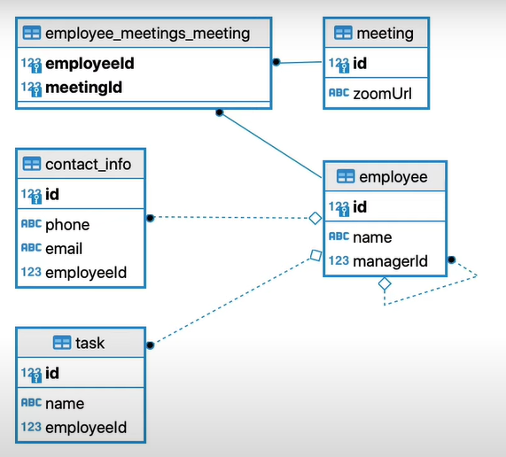

# Data Model

## Employee Table 🧑🏽‍💻

- Employee has id, name and managerId
- Can reference self (managers and direct reports)
- If manager is deleted set reference to NULL
- One-to-One relationship with Contact Info
- One-to-Many relationship with Tasks
- Many-to-Many relationship with Meetings

## Contact Info Table 📇

- Contact has id, phone, email, employeeId
- One-to-one relationship with Employee
- Delete if Employee is deleted

## Task Table 🗒️

- Task has id, name, employeeId
- Many-to-One relationship with Employee
- Set employee Id to NULL if Employee is deleted

## Meeting Table 🫱🏾‍🫲🏽

- Meeting has id, zoomUrl
- Many-to-Many relationship with Employee (via relationship table)
- Remove Employee as attendee if Employee is deleted

---

**Tutorial:** [TypeORM Relations Tutorial - FULL details! - Marius Espejo](https://www.youtube.com/watch?v=rKgZLVgdvAY&list=PLlaDAvA2MhR2jb8zavu6I-w1BA878aHcB&index=3)

**TypeORM Documentation:** [typeorm.io](https://typeorm.io/)
